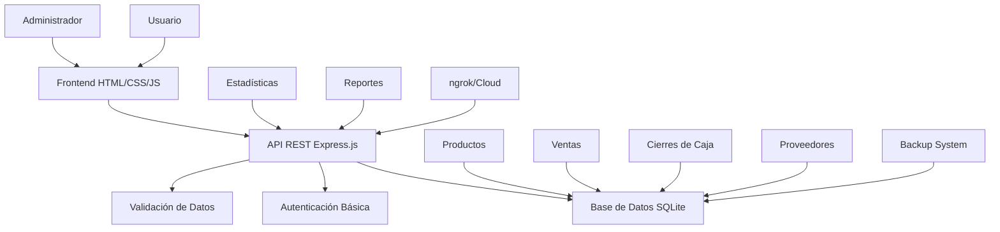

# Potencial del Sistema POS para Mercados y Tiendas

## Introducción

El Sistema POS representa una solución innovadora y completa para la gestión de puntos de venta, específicamente diseñada para optimizar las operaciones en mercados, tiendas minoristas y establecimientos comerciales de tamaño pequeño a mediano. Esta plataforma combina tecnología moderna con facilidad de uso, ofreciendo un potencial significativo para transformar la eficiencia operativa y la rentabilidad de los negocios minoristas.

## Características Principales

### Gestión Integral de Productos
- **CRUD completo**: Crear, leer, actualizar y eliminar productos con facilidad
- **Búsqueda avanzada**: Por nombre, código y categoría con soporte para acentos
- **Control de inventario**: Seguimiento automático de stock y alertas de bajo inventario
- **Categorización**: Organización lógica de productos por categorías personalizables

### Procesamiento Avanzado de Ventas
- **Múltiples métodos de pago**: Efectivo, transferencia, débito y crédito con montos detallados
- **Cálculo automático**: Totales, impuestos y vuelto en tiempo real
- **Generación de facturas**: Automática con numeración secuencial
- **Registro detallado**: Historial completo de transacciones con timestamps precisos

### Dashboard de Administración
- **Estadísticas en tiempo real**: Ventas, productos más vendidos, ingresos totales
- **Gestión de inventario**: Vista completa del stock disponible
- **Análisis de ventas**: Tendencias y patrones de consumo
- **Cierre de caja**: Funcionalidad completa con conciliación automática

### Seguridad y Confiabilidad
- **Autenticación robusta**: Sistema de login con credenciales seguras
- **Protección de datos**: Validación de entrada y prevención de inyección SQL
- **Copias de seguridad**: Sistema integrado para respaldo de datos
- **Logging completo**: Registro de todas las operaciones para auditoría

## Beneficios Operativos para Mercados y Tiendas

### Eficiencia en Transacciones
- **Procesamiento rápido**: Reducción significativa del tiempo por transacción
- **Menos errores**: Cálculos automáticos eliminan errores humanos
- **Flujo continuo**: Interfaz intuitiva minimiza tiempos de capacitación

### Control de Inventario Optimizado
- **Visibilidad en tiempo real**: Conocimiento exacto del stock disponible
- **Prevención de pérdidas**: Alertas automáticas de productos agotados
- **Reabastecimiento inteligente**: Análisis de ventas para predicción de demanda

### Análisis de Negocio Mejorado
- **Métricas clave**: Seguimiento de KPIs importantes como ventas diarias, productos más vendidos
- **Toma de decisiones**: Datos históricos para estrategias de mercadeo
- **Rentabilidad**: Identificación de productos de alto y bajo rendimiento

### Experiencia del Cliente
- **Atención rápida**: Procesos más eficientes mejoran la satisfacción del cliente
- **Transparencia**: Facturas claras y detalladas
- **Flexibilidad de pago**: Múltiples opciones de pago aumentan las conversiones

## Casos de Uso Específicos

### Mercado Tradicional
**Escenario**: Un mercado familiar con 50-100 productos diarios
- **Beneficio**: Digitalización completa de inventario y ventas
- **Resultado**: Reducción del 40% en tiempo de cierre diario, mejor control de pérdidas por robo o error

### Tienda de Conveniencia
**Escenario**: Establecimiento 24/7 con alta rotación de productos
- **Beneficio**: Procesamiento rápido de transacciones pequeñas y múltiples métodos de pago
- **Resultado**: Aumento del 25% en throughput de clientes, reducción de colas

### Tienda de Electrónicos
**Escenario**: Inventario diverso con productos de alto valor
- **Beneficio**: Seguimiento preciso de stock y precios variables
- **Resultado**: Minimización de discrepancias de inventario, mejor gestión de garantías

### Restaurante o Cafetería
**Escenario**: Ventas rápidas con menús variables
- **Beneficio**: Adaptación del sistema para productos perecederos y combos
- **Resultado**: Control preciso de costos, análisis de popularidad de platos

### Farmacia
**Escenario**: Requisitos regulatorios estrictos y productos controlados
- **Beneficio**: Registro detallado de ventas para cumplimiento normativo
- **Resultado**: Mejor trazabilidad, reducción de riesgos legales

## Ventajas Competitivas

### Frente a Sistemas Tradicionales
- **Costo**: Solución gratuita/open-source vs. licencias caras de sistemas propietarios
- **Flexibilidad**: Personalización completa vs. sistemas rígidos
- **Mantenimiento**: Actualizaciones autónomas vs. dependencias de proveedores

### Frente a Soluciones en la Nube
- **Privacidad**: Datos locales vs. dependencia de servicios externos
- **Conectividad**: Funcionamiento offline vs. requerimientos constantes de internet
- **Costo operativo**: Sin suscripciones mensuales vs. pagos recurrentes

### Innovaciones Técnicas
- **Arquitectura moderna**: Node.js + SQLite vs. tecnologías legacy
- **Interfaz responsive**: Diseño moderno y adaptable vs. interfaces obsoletas
- **API RESTful**: Integración fácil con otros sistemas vs. soluciones cerradas

## Opciones de Despliegue y Escalabilidad

### Despliegue Local
- **Ventaja**: Control total, sin dependencias externas
- **Uso**: Pequeños negocios sin necesidad de acceso remoto
- **Limitación**: Acceso limitado a ubicación física

### Despliegue con ngrok
- **Ventaja**: Acceso remoto seguro con URLs estables
- **Uso**: Negocios con múltiples ubicaciones o gestión remota
- **Costo**: Gratuito con opción premium para dominios personalizados

### Despliegue en la Nube
- **Plataformas**: Railway, Render, Heroku
- **Ventaja**: Alta disponibilidad, escalabilidad automática
- **Uso**: Cadenas de tiendas o negocios en crecimiento
- **Costo**: Modelos pay-as-you-go económicos

### Escalabilidad Horizontal
- **Base de datos**: Migración fácil de SQLite a PostgreSQL/MySQL
- **Arquitectura**: Separación clara de frontend/backend permite microservicios
- **Integraciones**: APIs abiertas para conexión con ERPs, sistemas de pago externos

## Arquitectura del Sistema

### Componentes Clave
- **Frontend**: Interfaz web responsive y moderna
- **Backend**: API REST robusta con Node.js y Express
- **Base de Datos**: SQLite para simplicidad y rendimiento
- **Seguridad**: Autenticación y validación en múltiples capas
- **Despliegue**: Opciones flexibles desde local hasta cloud

## Conclusión

El Sistema POS ofrece un potencial transformador para el sector minorista, combinando tecnología accesible con funcionalidades empresariales completas. Su capacidad para adaptarse a diversos escenarios comerciales, desde mercados tradicionales hasta tiendas especializadas, lo posiciona como una solución versátil y económica.

### Impacto Esperado
- **ROI**: Retorno de inversión en 3-6 meses para la mayoría de negocios
- **Eficiencia**: Reducción del 30-50% en tiempo operativo diario
- **Crecimiento**: Base sólida para escalar operaciones comerciales
- **Competitividad**: Ventaja tecnológica sobre competidores tradicionales

### Próximos Pasos Recomendados
1. **Implementación piloto**: Prueba en una ubicación pequeña
2. **Capacitación del personal**: Entrenamiento completo en el sistema
3. **Personalización**: Adaptación a necesidades específicas del negocio
4. **Monitoreo continuo**: Seguimiento de métricas y optimización

Este sistema no solo digitaliza operaciones existentes, sino que abre nuevas posibilidades para el crecimiento y la innovación en el comercio minorista.